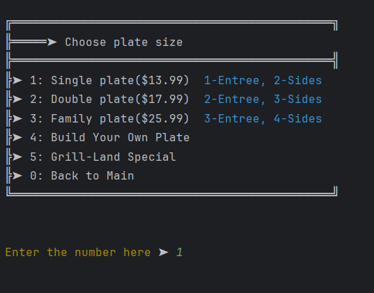
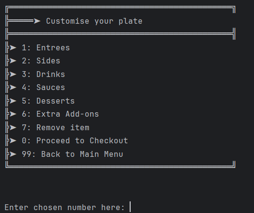
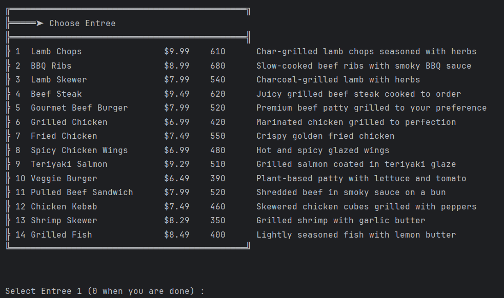
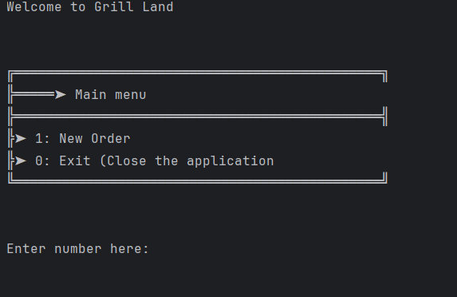
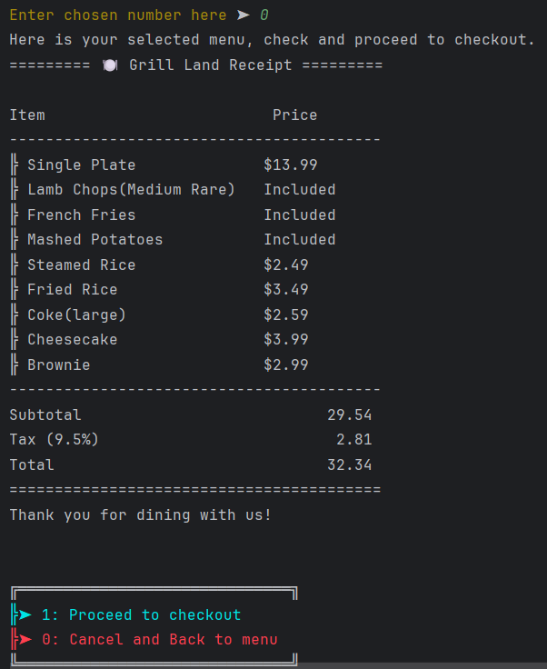

# 🧾 Grill Land Bar and Restaurant Point of Sale (POS) App

The Grill Land Point of Sale (POS) is a command-line application that lets customers easily place their own orders at Grill Land. Through a simple text-based menu, customers can browse available plates, choose their entrees and sides, view prices, and confirm their orders.

---

## 🚀 Features

* Browse the full restaurant menu (entrees, sides, drinks, sauces, desserts, extras)
* Build different types of plates (Single, Double, Family, Signature, Custom)
* Enforce plate rules (required number of entrees/sides, extra charges, variants)
* Customize items (doneness level for meats, special variants, etc.)
* Automatically calculate plate price + extra item costs
* User-friendly text-based menu navigation
* Item cloning to protect original menu data
* Input validation for safe user selections
* Warnings when required items are missing
* Full order summary before checkout
* Receipt generator
  * Saves receipt as a .txt file
  * Uses timestamp format yyyyMMdd-HHmmss.txt
* Centralized menu loading from CSV files
* Organized categories for easier filtering and searching

---

## 🧠 Concepts Used

This project demonstrates several **core Java concepts**:

* Classes and Objects
* Constructors, Getters & Setters
* Arrays / ArrayLists
* Loops and Conditionals
* Exception Handling (`try`, `catch`, `throws`)
* File I/O (reading & writing transactions to a file)
* Scanner input for user interaction
* Polymorphism, Inheritance and Encapsulation

---
## 🖥️ Screenshots

<p align="center">
  
</p>
<p align="center">
  
</p>
<p align="center">
  
</p>
<p align="center">
  
</p>
<p align="center">
  
</p>


## 🧩 Code Snippets

### 👇 A robust menu display and handling method that displays the list of available entrees and lets the user pick which ones to add to their plate. It checks if the plate has limits on how many entrees can be added, and warns the user when they reach that limit. If the entrée requires a cooking style (like steak), it also asks the user to choose the doneness. The selected entrée is cloned, updated with any chosen variant, and then added to the plate.
```java 
public static void entreeMenu(Plate plate){

String[] variants = {"1: Rare", "2: Medium Rare","3: Medium","4: Medium Well","5: Well Done"};

        DisplayFormatters.menuDisplay("Choose Entree", RestaurantMenu.entreeMenu);
int i = 1;
boolean isBuildYourOwn = plate instanceof BuildYourOwn;

        while (true) {

                if ((plate.getAllowedEntrees() == plate.getEntrees().size()) && !isBuildYourOwn) {
        DisplayFormatters.warningDisplay("You have filled the Entrees allowed for your plate. After these each entree will be charged.");
            }

int userChoice = InputValidators.getUserNumberInput("Select Entree " + i + " (0 when you are done) ", RestaurantMenu.entreeCount);
            if (userChoice == 0) {
        if (!isBuildYourOwn) {
int minimum = plate.getAllowedEntrees();
int added = plate.getEntrees().size();
int remaining = minimum - added;
                    if (remaining > 0) {
String text = plate.getName() + " requires atleast " + minimum + " Entrees. Must choose " + remaining + " more to proceed.";
i--;
        DisplayFormatters.warningDisplay(text);
                        continue;
                                }else{
                                break;
                                }
                                } else {
                                break;
                                }

                                } else {
MenuItem item = Filters.filterByCategoryAndId("entree", userChoice);
                assert item != null;
MenuItem clonedItem = new MenuItem(item);

                if (Tools.variantApplicableEntreeIds.contains(item.getId())) {
        DisplayFormatters.screenDisplay("How do you like your meat cooked", variants);
int input;
                    while(true){
input = InputValidators.getUserNumberInput("Enter your chosen number here", 5);
                        if(input >= 1 && input <= 5){
        break;
        }else {
        System.out.println("Invalid input!");
                        }
                                }
String chosenVariant = variants[input - 1].split(":")[1].trim();

                    clonedItem.setVariant(chosenVariant);
                }
                        plate.addEntree(clonedItem);
                System.out.print("Entree " + i + " - ");
                DisplayFormatters.itemDisplay(clonedItem);
            }
i++;

        }
        }

## 🛠️ How to Run

### 1. Clone the repository

```bash
git clone https://github.com/iBel251/Grill-Land
```

### 2. Open in your IDE

Open the folder in **IntelliJ IDEA**, **VS Code**, or any Java IDE.

### 3. Compile and run
Navigate to Main.java in src/main/java/com.capstone directory and run the program

---

## 💾 File Handling

Menu is saved in resources folder (menu.csv)
All receipts are saved to a local text file (`yyyyMMdd-hhmmss.txt format.txt`) so that data is **retained between sessions**.

---

## 📂 Project Structure

```
Accounting-Ledger-App/
│
├── src/
│   └── main/java/capstone/
│       └── dishes
│           ├── BuildYourOwn.java
│           ├── DoublePlate.java
│           ├── FamilyPlate.java
│           ├── MenuItem.java
│           ├── Plate.java
│           ├── SignaturePlate.java
│           └── SinglePlate.java
│       └── ui
│           └── Menu.java
│       └── utils
│           ├── DisplayFormatter.java
│           ├── FileManager.java
│           ├── Filters.java
│           ├── InputValidators.java
│           ├── MenuManager.java
│           └── Tools.java
│       └── RestaurantMenu.java
│       └── Start.java
│
│   └── resources
        └── menu.csv
    
```

---

## 🎯 Future Improvements

* Implement Login and Signup
* Point based rewards
* Membership discounts
* Improve file structure or switch to JSON storage
* Better User Interface

---

## 👨‍💻 Author

**Imran Ahmed**
Java Developer | Passionate about learning clean and structured coding.

---